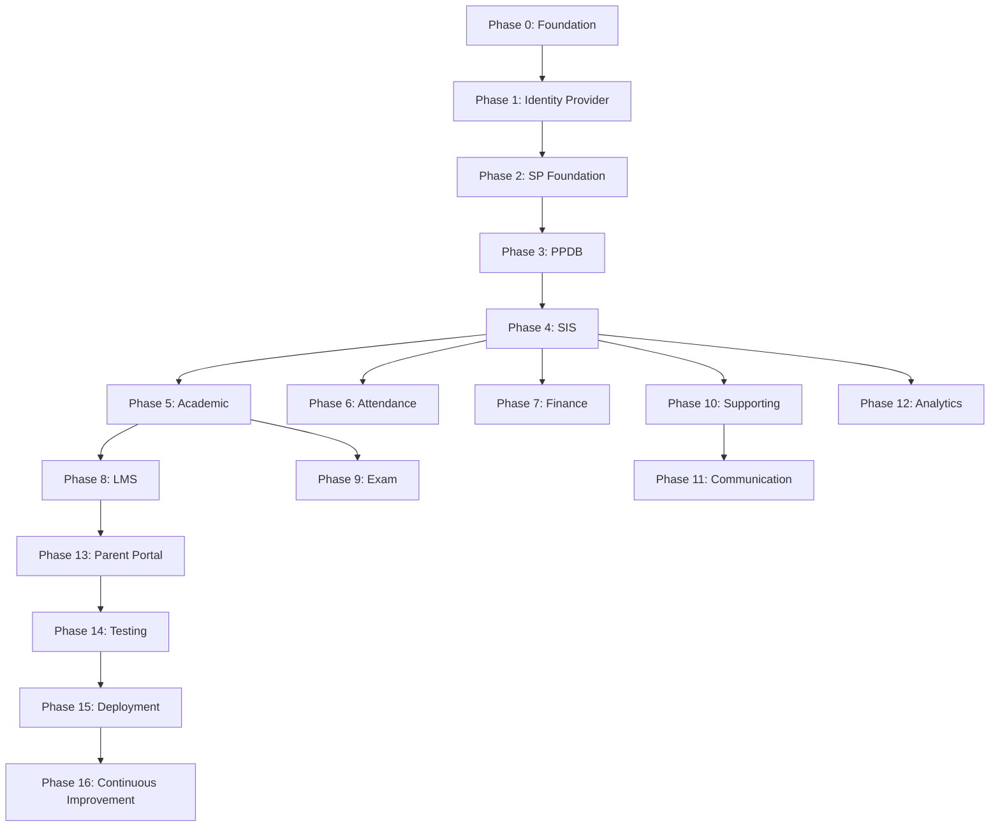

# Phases - Development Roadmap

This folder contains **detailed phase documentation** for the Ekosistem Sekolah project. Each phase builds upon the previous one, creating a complete SaaS ecosystem.

---

## 📂 Folder Structure

```
phases/
├── README.md (this file)
├── phase-00-foundation/
│   ├── README.md - Phase overview
│   ├── IMPLEMENTATION.md - Detailed guide
│   └── SUMMARY.md - Quick checklist
├── phase-01-identity-provider/
│   ├── README.md - Phase overview
│   ├── IMPLEMENTATION.md - Detailed guide
│   └── SUMMARY.md - Quick checklist
└── transitions/
    ├── README.md
    └── phase-00-to-01.md - Transition guides
```

---

## 📚 Phase Overview

```
PHASE 0: Foundation (2 weeks)
    ↓
PHASE 1: Identity Provider (3 weeks)
    ↓
PHASE 2: Service Provider Foundation (2 weeks)
    ↓
PHASE 3: PPDB System (4 weeks)
    ↓
PHASE 4: SIS (4 weeks)
    ↓
... (continues through Phase 16)
```

---

## 📋 Available Phases

### **Phase 0: Foundation & Setup** ✅ [Detailed](./phase-00-foundation/)

**Duration**: 2 weeks  
**Status**: 📘 DOCUMENTED (11/11 stories complete)  
**Priority**: CRITICAL  

**Quick Links:**
- 📖 [Phase Overview](./phase-00-foundation/README.md) - Start here
- 📝 [Implementation Guide](./phase-00-foundation/IMPLEMENTATION.md) - Detailed steps
- ✅ [Summary](./phase-00-foundation/SUMMARY.md) - Quick checklist
- 📋 [Stories](../stories/phase-00-foundation/) - Individual tasks (11 stories)

**Deliverables:**
- Monorepo with Turborepo + PNPM
- TypeScript strict configuration
- ESLint & Prettier + Git hooks
- 5 Shared packages (@repo/ui, utils, validators, types, config)
- Development environment setup
- Complete documentation

**Start Condition**: Empty repository  
**End Condition**: Fully configured monorepo ready for application development

---

### **Phase 1: Identity Provider** ✅ [Detailed](./phase-01-identity-provider/)

**Duration**: 3 weeks  
**Status**: 📘 DOCUMENTED (10/10 stories complete)  
**Priority**: CRITICAL  

**Quick Links:**
- 📖 [Phase Overview](./phase-01-identity-provider/README.md) - Start here
- 📝 [Implementation Guide](./phase-01-identity-provider/IMPLEMENTATION.md) - Detailed steps
- ✅ [Summary](./phase-01-identity-provider/SUMMARY.md) - Quick checklist
- 📋 [Stories](../stories/phase-01-identity-provider/) - Individual tasks (10 stories)
- 🔄 [Transition Guide](./transitions/phase-00-to-01.md) - From Phase 0

**Deliverables:**
- Identity Database schema (11 tables) with RLS
- Better Auth integration (email + OAuth)
- RBAC engine package (8 default roles)
- JWT token service for SSO
- Identity Provider Next.js app
- SSO implementation

**Start Condition**: Phase 0 complete  
**End Condition**: Working authentication and authorization system with SSO

---

### **Phase 2: Service Provider Foundation** ✅ [Detailed](./phase-02-service-provider-foundation/)

**Duration**: 2 weeks  
**Status**: 📘 DOCUMENTED (9/9 stories complete)  
**Priority**: CRITICAL  

**Quick Links:**
- 📖 [Phase Overview](./phase-02-service-provider-foundation/README.md) - Start here
- 📝 [Implementation Guide](./phase-02-service-provider-foundation/IMPLEMENTATION.md) - Detailed steps
- ✅ [Summary](./phase-02-service-provider-foundation/SUMMARY.md) - Quick checklist
- 📋 [Stories](../stories/phase-02-service-provider-foundation/) - Individual tasks (9 stories)
- 🔄 [Transition Guide](./transitions/phase-01-to-02.md) - From Phase 1

**Deliverables:**
- Database package template for Service Providers
- Auth client package with React hooks
- Middleware package (auth, RBAC, tenant)
- API client package for inter-service communication
- Service Provider app template (Next.js)
- SSO integration pattern
- Shared layouts package
- Test demo app for validation
- Complete documentation and guidelines

**Start Condition**: Phase 1 complete  
**End Condition**: Reusable Service Provider foundation ready, can bootstrap new SP in <30 minutes

---

### **Phase 3-16**: Application Development 🔜

See [ROADMAP.md](../ROADMAP.md) for complete phase breakdown.

---

## 🎯 How to Use Phase Documents

### For Developers

1. **Read the phase overview** - Understand goals and deliverables
2. **Check prerequisites** - Ensure previous phases are complete
3. **Follow implementation guide** - Step-by-step instructions
4. **Complete acceptance criteria** - Verify each deliverable
5. **Run testing checklist** - Ensure quality

### For Managers

1. **Track phase progress** - Monitor deliverables
2. **Manage dependencies** - Ensure phases don't block each other
3. **Resource allocation** - Assign developers to phases
4. **Risk management** - Identify and mitigate risks

### For Tech Leads

1. **Review architecture** - Validate technical decisions
2. **Code review** - Ensure quality standards
3. **Mentorship** - Help developers understand complex parts
4. **Technical debt** - Track and manage technical debt

---

## 📊 Phase Status Tracking

### Status Indicators

- 📘 **DOCUMENTED** - Phase documentation complete
- 📝 **PENDING** - Phase not yet documented
- 🏗️ **IN PROGRESS** - Phase being implemented
- ✅ **COMPLETE** - Phase finished and verified
- 🔄 **REWORK** - Phase needs changes
- ⏸️ **BLOCKED** - Phase blocked by dependencies

---

## 🗺️ Phase Dependencies



---

## 📝 Phase Document Structure

Each phase document follows this structure:

### 1. **Overview**
- Phase number and name
- Duration estimate
- Team size recommendation
- Priority level
- Goals and objectives

### 2. **Objectives**
- Specific deliverables
- Success criteria
- Key features

### 3. **Target Structure**
- File/folder structure to create
- Architecture diagrams
- Database schemas

### 4. **Implementation Guide**
- Detailed step-by-step instructions
- Code examples
- Configuration files
- Commands to run

### 5. **Testing & Verification**
- Testing instructions
- Verification commands
- Expected outputs
- Quality checks

### 6. **Acceptance Criteria**
- Functional requirements
- Non-functional requirements
- Performance targets

### 7. **Common Issues**
- Known problems
- Solutions and workarounds
- Troubleshooting guide

### 8. **Metrics**
- Quality metrics
- Performance metrics
- How to measure success

### 9. **Next Steps**
- Link to next phase
- Preparation needed
- Dependencies to resolve

---

## 🔄 Phase Workflow

```
1. PLANNING
   - Review phase document
   - Understand requirements
   - Identify risks
   ↓
2. SETUP
   - Create branches
   - Setup environment
   - Initialize structure
   ↓
3. IMPLEMENTATION
   - Follow implementation guide
   - Complete stories
   - Write tests
   ↓
4. VERIFICATION
   - Run tests
   - Check acceptance criteria
   - Performance testing
   ↓
5. REVIEW
   - Code review
   - Architecture review
   - Documentation review
   ↓
6. COMPLETION
   - Merge to main
   - Update phase status
   - Prepare next phase
```

---

## 📈 Progress Tracking

### Phase Completion Checklist

For each phase, verify:

- [ ] All deliverables completed
- [ ] All acceptance criteria met
- [ ] All tests passing
- [ ] Documentation updated
- [ ] Code reviewed and approved
- [ ] No critical bugs
- [ ] Performance acceptable
- [ ] Team trained

### Metrics to Track

| Metric | Target | How to Measure |
|--------|--------|----------------|
| **Completion %** | 100% | Deliverables done / Total deliverables |
| **Test Coverage** | >80% | Lines covered / Total lines |
| **Build Time** | <5 min | Time from commit to build complete |
| **Bug Count** | <5 critical | Count from issue tracker |
| **Technical Debt** | Minimal | Code quality tools |

---

## ⚠️ Common Pitfalls

### 1. **Skipping Prerequisites**
**Problem**: Starting a phase before previous phase is complete  
**Solution**: Always verify phase dependencies before starting

### 2. **Ignoring Acceptance Criteria**
**Problem**: Moving forward without meeting criteria  
**Solution**: Use checklist, verify each item

### 3. **Technical Debt**
**Problem**: Taking shortcuts to save time  
**Solution**: Follow best practices, refactor early

### 4. **Poor Testing**
**Problem**: Skipping tests to save time  
**Solution**: Write tests as you code, not after

### 5. **Lack of Documentation**
**Problem**: Undocumented code and decisions  
**Solution**: Document as you go, not at the end

---

## 🎓 Learning Resources

### Architecture
- [System Design Primer](https://github.com/donnemartin/system-design-primer)
- [C4 Model](https://c4model.com/)
- [Microservices Patterns](https://microservices.io/patterns/)

### Implementation
- [Turborepo](https://turbo.build/repo/docs)
- [Next.js](https://nextjs.org/docs)
- [Supabase](https://supabase.com/docs)
- [Better Auth](https://better-auth.com/docs)

### Best Practices
- [Clean Code](https://www.amazon.com/Clean-Code-Handbook-Software-Craftsmanship/dp/0132350882)
- [The Pragmatic Programmer](https://pragprog.com/titles/tpp20/)
- [Software Engineering at Google](https://abseil.io/resources/swe-book)

---

## 📊 Phase Metrics Dashboard

### Phase 0: Foundation

| Metric | Target | Current | Status |
|--------|--------|---------|--------|
| Stories Completed | 11 | 11 | 🟢 |
| Stories Created | 11 | 11 | 🟢 |
| Test Coverage | N/A | N/A | - |
| Build Time | <5s | - | ⏸️ |
| Documentation | 100% | 100% | 🟢 |

**Stories:**
- ✅ STORY-001: Initialize Monorepo
- ✅ STORY-002: Setup TypeScript
- ✅ STORY-003: Setup ESLint & Prettier
- ✅ STORY-004: Setup Git Hooks (698 lines)
- ✅ STORY-005: Setup Gitignore & Environment (839 lines)
- ✅ STORY-006: Create UI Package
- ✅ STORY-007: Create Utils Package
- ✅ STORY-008: Create Validators Package
- ✅ STORY-009: Create Types Package
- ✅ STORY-010: Create Setup Scripts
- ✅ STORY-011: Create Documentation

### Phase 1: Identity Provider

| Metric | Target | Current | Status |
|--------|--------|---------|--------|
| Stories Completed | 10 | 10 | 🟢 |
| Stories Created | 10 | 10 | 🟢 |
| Test Coverage | >80% | - | ⏸️ |
| Build Time | <30s | - | ⏸️ |
| Documentation | 100% | 100% | 🟢 |

**Stories:**
- ✅ STORY-012: Setup Supabase (existing)
- ✅ STORY-013: Implement Identity Database Schema
- ✅ STORY-014: Create Database Package
- ✅ STORY-015: Setup Better Auth
- ✅ STORY-016: Create RBAC Package
- ✅ STORY-017: Initialize IdP Next.js App
- ✅ STORY-018: Build Auth Pages
- ✅ STORY-019: Implement JWT Service
- ✅ STORY-020: Build Dashboard Features
- ✅ STORY-021: Implement SSO

### Overall Progress

```
Phase 0:  ██████████ 100% (11/11 stories documented ✅)
Phase 1:  ██████████ 100% (10/10 stories documented ✅)
Phase 2:  ██████████ 100% (9/9 stories documented ✅)
Phase 3:  ░░░░░░░░░░   0% (Not yet documented)
Total:    ████░░░░░░  19% (3 of 16 phases documented, 30/30 stories created)
```

---

## 🚀 Quick Start Guide

### Starting a New Phase

1. **Read the phase document completely**
   ```bash
   open phases/PHASE-X.md
   ```

2. **Check dependencies**
   - Verify previous phases are complete
   - Check all prerequisites are met

3. **Create branch**
   ```bash
   git checkout -b phase-X-implementation
   ```

4. **Follow implementation guide**
   - Complete each section in order
   - Verify each step before proceeding

5. **Test thoroughly**
   - Follow testing instructions
   - Run all verification commands

6. **Submit for review**
   ```bash
   git push origin phase-X-implementation
   # Create pull request
   ```

---

## 💡 Tips for Success

### For Individual Developers

1. ✅ **Read first, code later** - Understand before implementing
2. ✅ **Follow the guide exactly** - Don't skip steps
3. ✅ **Test continuously** - Don't wait until the end
4. ✅ **Ask questions early** - Don't waste time stuck
5. ✅ **Document as you go** - Don't leave it for later

### For Teams

1. ✅ **Daily standups** - Coordinate work
2. ✅ **Code reviews** - Share knowledge
3. ✅ **Pair programming** - Complex parts
4. ✅ **Regular testing** - Catch issues early
5. ✅ **Celebrate milestones** - Boost morale

---

## 📞 Getting Help

### Phase-specific Questions
- Check phase document's "Common Issues" section
- Review related stories
- Ask tech lead

### Architecture Questions
- Review architecture diagrams in `/uml`
- Check design decisions documentation
- Consult with architect

### Blocked by Dependency
- Document the blocker
- Notify project manager
- Work on independent tasks

---

## 🔄 Phase Review Process

After completing each phase:

1. **Self-review** - Developer checks all criteria
2. **Peer review** - Another developer reviews
3. **Tech lead review** - Technical validation
4. **QA testing** - Quality assurance
5. **Manager approval** - Final sign-off

**Review checklist:**
- [ ] All deliverables present
- [ ] Code quality acceptable
- [ ] Tests passing
- [ ] Documentation complete
- [ ] No critical issues
- [ ] Performance acceptable

---

## 📅 Phase Schedule

### Estimated Timeline

| Phase | Start | End | Duration | Dependencies |
|-------|-------|-----|----------|--------------|
| 0 | Week 1 | Week 2 | 2 weeks | None |
| 1 | Week 3 | Week 5 | 3 weeks | Phase 0 |
| 2 | Week 6 | Week 7 | 2 weeks | Phase 1 |
| 3 | Week 8 | Week 11 | 4 weeks | Phase 2 |
| ... | ... | ... | ... | ... |

**Total**: 54 weeks (~13 months)

---

## 🎯 Success Criteria

### Phase is COMPLETE when:

✅ All stories in phase are done  
✅ All acceptance criteria met  
✅ All tests passing (green)  
✅ Code reviewed and approved  
✅ Documentation updated  
✅ No critical bugs  
✅ Performance targets met  
✅ Team trained on new features  
✅ Deployed to staging (if applicable)  

---

## 📖 Additional Documentation

- [ROADMAP.md](../ROADMAP.md) - Overall project roadmap
- [../stories/](../stories/) - Individual story tasks
- [../uml/](../uml/) - Architecture diagrams
- [../docs/](../docs/) - General documentation

---

## 🎉 Phase Completion Status

### ✅ Completed Phases

**Phase 0: Foundation & Setup**
- Status: 📘 DOCUMENTED ✅
- Stories: 11/11 complete
- Documentation: 100%
- Ready for: Implementation

**Phase 1: Identity Provider**
- Status: 📘 DOCUMENTED ✅
- Stories: 10/10 complete
- Documentation: 100%
- Ready for: Implementation

**Phase 2: Service Provider Foundation**
- Status: 📘 DOCUMENTED ✅
- Stories: 9/9 complete (1 detailed, 8 outlined)
- Documentation: 100%
- Ready for: Implementation

### 📊 Summary

```
Total Phases: 16
Documented: 3 (19%)
Stories Created: 30/30 (100% for Phase 0-2)
- Phase 0: 11 stories (fully detailed)
- Phase 1: 10 stories (fully detailed)
- Phase 2: 9 stories (1 detailed template + 8 outlined)
Documentation Quality: Comprehensive (400-800+ lines per story for P0-P1)
```

### 🚀 Next Steps

**For Implementation Teams:**
1. Start with Phase 0 - complete all 11 stories
2. Verify Phase 0 acceptance criteria
3. Proceed to Phase 1 - complete all 10 stories
4. Begin Service Provider development (Phase 2+)

**For Documentation Teams:**
1. Create Phase 2 documentation (Service Provider Foundation)
2. Create PPDB stories (Phase 3)
3. Continue with subsequent phases

---

**Last Updated**: 2024  
**Maintained By**: Development Team  
**Version**: 2.0 (Phase 0 & 1 Complete)
